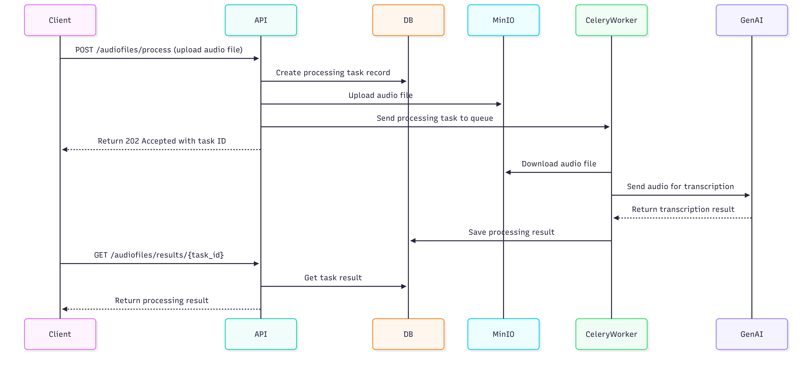

# NLP Task Processing API

## Project Description
This project is an asynchronous API for processing audio files using Google GenAI. Key features include:
- Uploading audio files via the API
- Storing files in MinIO
- Asynchronous processing using Celery workers
- Transcription and commentary of audio content using Google GenAI
- Saving processing results in PostgreSQL

## Technology Stack
- **Python 3.13**
- **FastAPI** - web framework
- **PostgreSQL** - primary database
- **Redis** - message broker for Celery
- **Celery** - asynchronous task processing
- **MinIO** - object storage for audio files
- **Google GenAI** - NLP audio processing
- **Docker** - containerization
- **SQLAlchemy** - ORM for database interaction
- **asyncio** - asynchronous programming

## Running the Project

### 1. Setup Environment Variables
Create a `.env` file in the project root with the following content (.env.example):
```env
# PostgreSQL
POSTGRES_DB=audio_db
POSTGRES_USER=admin
POSTGRES_PASSWORD=strongpassword

# Redis
REDIS_HOST=redis
REDIS_PORT=6379

# MinIO
MINIO_ROOT_USER=minioadmin
MINIO_ROOT_PASSWORD=strongpassword
MINIO_ENDPOINT=minio:9000
MINIO_BUCKET_NAME=audio-files

# AI
GENAI_MODEL_NAME=gemini-3-flash-preview
API_KEY=your_secret_api_key

DATABASE_URL=postgresql+asyncpg://admin:strongpassword@db:5432/audio_db
```
### 2. Build and Run Containers
```
# Build and start all services
docker-compose up --build
```
### 3. Verify Services

- API: Access at http://localhost:8000
- Task Monitoring (Flower): Access at http://localhost:5555
- MinIO Console: Access at http://localhost:9001

## Request processing diagram


# Lifecycle of Audio Processing

The lifecycle of audio processing in the system can be described as follows:

## 1. Uploading and Task Initialization
- **Client Uploads Audio File**: The client sends a POST request to `/audiofiles/process` with an audio file attached.
- **API Handles Request**:
  - The API validates the uploaded file to ensure it is an audio file.
  - A new processing task record is created in the PostgreSQL database with a status of `PENDING`.
  - The audio file is uploaded to MinIO (S3-compatible object storage) for reliable and scalable storage.
  - The task is sent to the Celery worker queue for asynchronous processing.
  - The API immediately returns a `202 Accepted` response to the client, including the unique `task_id` for tracking the task's progress.

## 2. Asynchronous Task Processing
- **Celery Worker Executes Task**:
  - The Celery worker retrieves the task from the queue.
  - The worker downloads the audio file from MinIO to process it locally.
  - The audio file is sent to the Google GenAI service for transcription and commentary generation.
  - Once the transcription and commentary are completed, the result is returned to the worker.
  - The worker updates the task record in the PostgreSQL database with the processing result and changes the status to `SUCCESS` (or `FAILURE` if an error occurs).
  - The audio file remains stored in MinIO even after processing. This ensures:
    - The API server is not cluttered with large files.
    - The file is available for potential reprocessing or debugging purposes.

## 3. Retrieving Results
- **Client Checks Task Status**:
  - The client periodically sends a GET request to `/audiofiles/results/{task_id}` to check the status of the task.
  - The API queries the PostgreSQL database, if task exists returns task's current status and result.

## 4. Scheduled Cleanup of MinIO Storage (to be implemented in future)
To maintain efficient storage usage and adhere to company policies:
- **Scheduled Cleanup Task**:
  - A periodic cleanup task (e.g., scheduled via Celery Beat or a similar scheduler) is implemented to remove outdated or unnecessary audio files from MinIO.
  - The frequency of this task depends on the company's data retention policy (e.g., once every 30 days).
  - During cleanup:
    - Files older than the retention period are identified and deleted from MinIO.
    - Corresponding database records may also be updated or archived to reflect the removal of the files.
  - This ensures that MinIO does not become overloaded with obsolete files while retaining files for a sufficient period to allow reprocessing if needed.

## Key Design Decisions
- **MinIO for Storage**:
  - Audio files are stored in MinIO rather than on the API server to prevent server overload and ensure scalability.
  - Files are retained after processing to enable reprocessing or debugging without requiring re-upload.
- **Asynchronous Processing**:
  - Tasks are processed asynchronously to handle large or numerous audio files efficiently without blocking the API.
  - Immediate acknowledgment (`202 Accepted`) improves user experience by reducing wait times.
- **Scheduled Cleanup**:
  - Regular cleanup of MinIO ensures compliance with storage policies and prevents unnecessary resource consumption.

This lifecycle ensures a robust, scalable, and maintainable system for audio processing while adhering to best practices for storage management and asynchronous task handling.